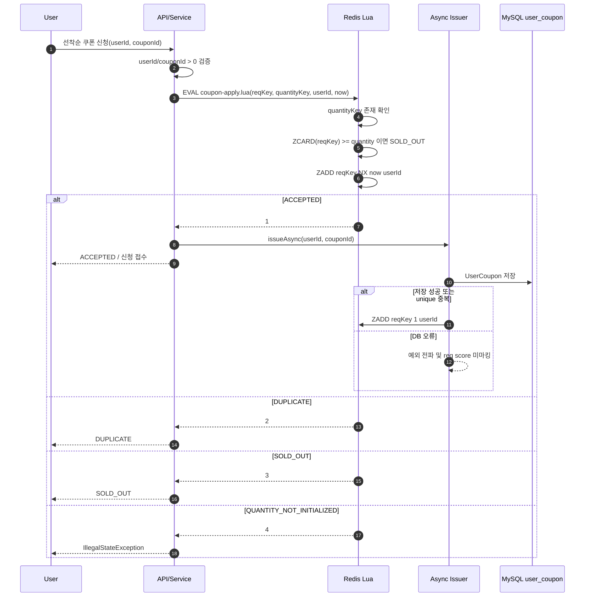
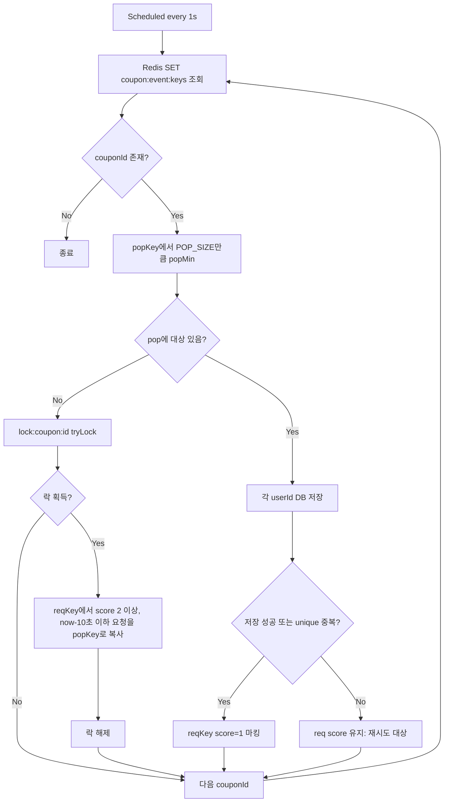
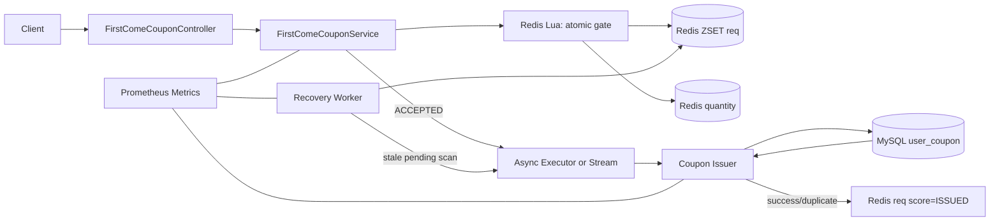
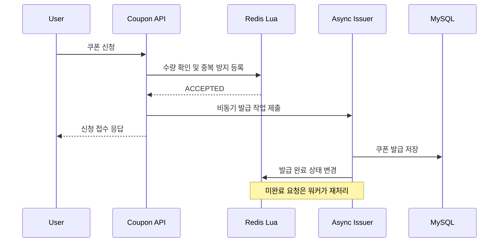
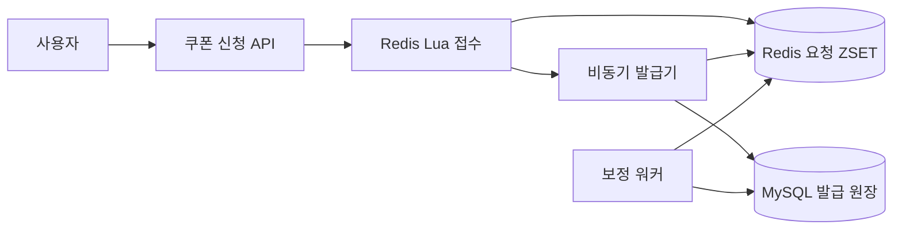

# 선착순 쿠폰 발급 아키텍처 분석

## 1. 현재 구현 요약

현재 선착순 쿠폰 발급은 **Redis를 선착순 접수/수량 제한의 1차 관문**으로 두고, **DB 저장은 비동기 발급 단계**에서 수행하는 구조다.
신청 API는 Redis Lua Script를 실행해 한 번의 원자적 연산으로 `중복 신청`, `재고 소진`, `접수 성공`을 판정한다.
접수 성공 후에는 `CouponIssueAsyncService`가 별도 스레드 풀에서 `user_coupon` 저장을 시도하고, 성공 또는 이미 발급된 중복 케이스는 Redis ZSET score를 `1`로 바꿔 발급 완료 상태를 표시한다.

> 참고: 코드에는 별도 스케줄러 워커(`FirstComeCouponWorker`)도 존재한다. 이 워커는 활성 이벤트 쿠폰 목록을 순회하면서 `req` ZSET의 오래된 미처리 요청을 `pop` ZSET으로 복사하고, `pop`에서 꺼낸 사용자를 DB에 저장하는 보정/배치성 발급 경로로 해석된다.

## 2. 핵심 컴포넌트

| 영역 | 컴포넌트 | 역할 |
| --- | --- | --- |
| API | `FirstComeCouponController` | `/api/v1/first-come-coupons/apply` 요청을 받아 `FirstComeCouponService.apply()`를 호출한다. 일반 쿠폰 발급용 `CouponController`와는 별도 경로다. |
| Apply Service | `FirstComeCouponService` | 선착순 신청 유효성 검증, Redis Lua Script 실행, 결과 코드별 응답/메트릭 처리, 비동기 발급 호출. |
| Redis Lua | `coupon-apply.lua` | `quantityKey` 확인, `ZCARD` 기반 수량 제한, `ZADD NX` 기반 중복 방지와 접수 기록을 원자적으로 수행. |
| Async Issuer | `CouponIssueAsyncService` | 접수 성공 사용자를 비동기로 DB 저장하고, 성공/중복 시 `req` ZSET score를 `1`로 마킹. |
| Scheduled Worker | `FirstComeCouponWorker` | 이벤트 쿠폰별로 `req -> pop` 복사 및 `pop` 소비를 수행하는 보정/배치 발급 루프. |
| Redis Key Factory | `CouponRedisKeys` | `coupon:{id}:req`, `coupon:{id}:pop`, `coupon:{id}:quantity`, `coupon:event:keys`, `lock:coupon:{id}` 키 생성. |
| Lock | Redisson `RLock` | 여러 워커 인스턴스가 같은 쿠폰의 `req -> pop` 복사를 동시에 수행하지 않도록 보호. |
| Persistence | `UserCouponRepository` | 최종 발급 이력 저장. DB unique 제약을 최후의 중복 방어선으로 사용. |
| Metrics | `CouponApplyMetrics`, `CouponIssueMetrics` | Redis apply 결과, DB 발급 결과, Redis 마킹 실패 등을 카운팅. |

## 3. Redis 데이터 모델

| Key | Type | Value/Score | 의미 |
| --- | --- | --- | --- |
| `coupon:{couponId}:quantity` | String | 발급 가능 수량 | Lua Script가 이 값이 없으면 `QUANTITY_NOT_INITIALIZED`를 반환한다. |
| `coupon:{couponId}:req` | ZSET | member=`userId`, score=`epochSecond` 또는 `1` | 신청 접수 큐 겸 상태 저장소. 최초 접수 시 현재 초를 score로 저장하고, DB 발급 완료/중복 확정 후 score를 `1`로 변경한다. |
| `coupon:{couponId}:pop` | ZSET | member=`userId`, score=`원 req score` | 워커가 DB 발급 대상으로 꺼내기 위한 중간 버퍼다. |
| `coupon:event:keys` | SET | `couponId` | 워커가 순회할 이벤트 쿠폰 목록이다. |
| `lock:coupon:{couponId}` | Redisson Lock | - | 같은 쿠폰의 `req -> pop` 복사 구간에 대한 분산 락이다. |

## 4. 신청/비동기 발급 흐름



## 5. 워커 보정/배치 발급 흐름



## 6. 현재 아키텍처의 장점

1. **Redis Lua Script로 접수 판정이 원자적이다.** `quantity` 확인, 현재 접수 수 카운트, 중복 방지 삽입이 한 스크립트 안에서 실행되어 동시성 경쟁을 DB보다 앞단에서 차단한다.
2. **DB 부하를 평탄화한다.** 요청 스레드는 Redis 판정 후 빠르게 반환하고, DB 쓰기는 비동기 스레드에서 처리한다.
3. **중복 방어가 2중이다.** Redis `ZADD NX`가 1차 중복 신청을 막고, DB unique 제약이 최종 발급 중복을 방어한다.
4. **결과 관측 지점이 있다.** 신청 결과와 발급 결과 메트릭이 분리되어 Redis 병목/DB 병목을 구분해 볼 수 있다.
5. **보정 워커가 존재한다.** 비동기 발급 실패 또는 미처리 요청을 스캔해 다시 DB 발급 대상으로 만들 수 있는 구조가 있다.

## 7. 리스크와 개선 포인트

### 7.1 수량 차감 기준이 `ZCARD(reqKey)`다

`coupon:{id}:req`는 신청 접수와 완료 상태를 함께 저장한다. Lua Script는 `ZCARD(reqKey)`로 수량을 제한하므로, DB 저장이 실패해도 이미 접수된 사용자는 수량을 점유한다. 선착순 정책이 “접수 기준”이면 적합하지만, “실제 발급 성공 기준”이면 실패분 복구 또는 별도 상태 관리가 필요하다.

### 7.2 비동기 발급과 워커 발급 경로가 중복된다

접수 성공 직후 `CouponIssueAsyncService`가 DB 저장을 수행하고, 동시에 `FirstComeCouponWorker`도 오래된 `req` 항목을 DB 저장 대상으로 삼는다. DB unique 제약으로 최종 중복은 방어되지만, 운영 관점에서는 다음을 명확히 해야 한다.

- 기본 발급 경로가 비동기 서비스인지 워커인지
- 워커가 “재처리 보정용”인지 “주 발급용”인지
- score 값 `1`, `epochSecond`, `2 이상`의 상태 의미가 문서화/상수화되어 있는지

### 7.3 `req -> pop` 복사가 remove가 아닌 add다

워커는 오래된 요청을 `pop`으로 복사한 뒤 `req`에는 그대로 둔다. DB 오류가 나면 `req` score가 유지되어 재시도 가능한 장점이 있지만, `pop`에서 꺼낸 뒤 실패하면 다시 `pop`에 남지 않는다. 다음 스케줄 주기에서 `req`를 다시 스캔해 `pop`으로 복사하는 방식이라 재시도 지연이 발생한다.

### 7.4 활성 쿠폰 키가 두 종류다

`ActiveCouponRegistry`는 `eventCoupon:active`를 쓰고, 워커는 `coupon:event:keys`를 조회한다. 둘 다 활성 쿠폰 목록처럼 보이므로 실제 운영 등록 경로를 하나로 통일하거나 책임을 분리해 명명하는 것이 좋다.

### 7.5 사용자 응답과 실제 발급 완료의 의미가 다르다

`FirstComeCouponController`는 Redis 접수가 성공하면 `ACCEPTED`를 반환하지만, 그 시점에 DB 발급까지 끝났다는 뜻은 아니다. 클라이언트 문구도 “발급 완료”가 아니라 “발급 요청 접수”로 표현하고, 쿠폰함은 `PENDING` 상태를 보여 주거나 짧은 폴링 후 최종 발급 상태를 조회하도록 계약을 맞춰야 한다.

## 8. 권장 목표 아키텍처



권장 방향은 **접수 게이트는 Redis Lua로 유지**하되, 발급 실행 경로를 하나로 단순화하는 것이다. 즉, 신청 성공 이벤트를 `Async Executor`, `Redis Stream`, `Kafka` 중 하나로 전달하고, 워커는 “stale pending 재큐잉” 역할만 수행하게 하면 책임이 명확해진다.

## 9. 개선 체크리스트

- [x] 선착순 전용 API 엔드포인트가 `FirstComeCouponService.apply()`를 호출하도록 연결한다.
- [ ] `coupon:event:keys`와 `eventCoupon:active` 중 하나로 활성 쿠폰 목록을 통일한다.
- [ ] Redis score magic number를 `PENDING`, `ISSUED` 같은 상수/Enum 문서로 고정한다.
- [ ] 비동기 발급 실패 시 재처리 정책을 명확히 한다. 예: Redis Stream pending entry, DLQ, retry count.
- [ ] “접수 수량 기준”과 “DB 발급 성공 기준” 중 어떤 정책인지 결정하고 수량 카운팅 모델을 맞춘다.
- [ ] 워커의 `req -> pop` 이동을 Lua Script로 원자화하거나, Redis Stream consumer group으로 대체하는 방안을 검토한다.

## 10. `@Async`를 유지할지에 대한 실무적 판단

### 결론

현재 의도인 **“HTTP 응답은 빨리 반환하고 DB 저장은 뒤에서 수행한다”**는 타당하다. 다만 `@Async` 자체를 발급 보장의 핵심 장치로 삼는 것은 권장하지 않는다. 현재 executor는 기본값 기준 core 8, max 16, queue 100이고 큐가 차면 `CallerRunsPolicy`가 요청 스레드에서 DB 저장을 실행한다. 따라서 순간 요청이 DB 처리량을 넘으면 응답 시간이 다시 DB 속도에 종속된다. 애플리케이션이 재시작되면 메모리 큐에 대기 중인 작업을 복원할 수도 없다.

실무적으로는 다음처럼 역할을 나누는 편이 명확하다.

1. **Redis Lua는 접수 확정과 선착순 순서만 담당한다.** 성공 즉시 `ACCEPTED`를 반환하므로 신청 API 지연은 짧게 유지한다.
2. **내구성 있는 큐가 DB 반영을 담당한다.** Redis Stream consumer group, Kafka, 또는 DB outbox를 사용해 프로세스 재시작 후에도 미처리 요청을 다시 소비한다.
3. **쿠폰함의 사용자 경험은 읽기 모델로 해결한다.** Redis 접수 결과를 쿠폰함 조회에 합쳐 `발급 처리 중`으로 즉시 노출하고, consumer가 DB 저장을 끝내면 `사용 가능`으로 전환한다.
4. **DB는 최종 원장으로 유지한다.** 결제에 사용할 쿠폰이라면 만료, 사용 여부, 중복 발급을 영속 저장소와 unique 제약으로 최종 보장한다.

즉, “Redis만 사용하면 쿠폰함에 빨리 보이는가?”의 답은 **쿠폰함 조회가 Redis의 접수 상태를 읽도록 만들면 즉시 보일 수 있지만, 현재처럼 쿠폰함이 DB만 조회하면 Redis만으로는 보이지 않는다**이다. 빠른 노출과 안전한 발급은 양자택일이 아니며, Redis read model과 내구성 있는 비동기 DB 반영을 함께 쓰는 것이 적절하다.

### 현재 구조를 유지한다면 최소 보완 사항

- executor queue depth, active thread 수, reject/CallerRuns 횟수를 부하 테스트 합격 조건에 포함한다.
- API 응답의 `ACCEPTED`와 DB의 `ISSUED`를 별도 상태로 정의한다.
- Redis `req`가 남아 있는 `@Async` 미처리 요청을 워커가 회수한다는 것을 장애 테스트로 증명한다.
- graceful shutdown 30초를 초과하는 backlog와 프로세스 강제 종료 상황을 시험한다.
- 비동기 경로와 워커 경로가 동시에 같은 요청을 처리해도 DB unique 제약으로 멱등성이 유지되는지 검증한다.

## 11. 부하 테스트 목표 설정

### RPS 숫자보다 먼저 정할 SLO

선착순 이벤트의 목표 부하는 임의의 업계 표준값이 아니라 **예상 동시 참여자와 유입 시간**에서 계산해야 한다.

```text
기준 RPS = 예상 동시 참여자 수 / 사용자가 몰리는 시간(초)
설계 RPS = 기준 RPS x 피크/안전 계수(보통 2~3)
```

예를 들어 오픈 직후 10초 동안 10,000명이 누를 것으로 예상하면 기준은 1,000 RPS다. 이 경우 최소 합격 목표를 1,000 RPS, 여유 목표를 2,000 RPS, 한계 탐색을 3,000 RPS 이상으로 두는 식이 설명 가능하다. “1,000 RPS를 견딘다”보다 **왜 1,000인지, 몇 초 동안인지, 어떤 실패율과 지연에서인지**가 더 중요하다.

권장 합격 기준 예시는 다음과 같다.

| 구간 | 제안 부하 | 확인 목적 |
| --- | ---: | --- |
| Warm-up | 100~300 RPS, 1~3분 | JIT, 커넥션 풀, Redis 연결 안정화 |
| Expected | 1,000 RPS, 5~10분 | 현재 목표 부하에서 지속 안정성 확인 |
| Peak | 2,000 RPS, 1~3분 | 예상치 2배의 순간 피크 흡수 확인 |
| Stress | 3,000 RPS부터 단계 증가 | 포화점과 병목 위치 확인 |
| Spike | 0에서 2,000~3,000 RPS로 즉시 상승 | 이벤트 오픈 순간의 급격한 유입 재현 |
| Soak/Drain | 부하 종료 후 backlog 0까지 | 접수된 쿠폰이 최종 DB에 모두 반영되는 시간 확인 |

각 구간에서 최소한 API p95/p99, 오류율, 실제 도달 iteration rate, Redis CPU/latency, executor queue/reject, DB connection pool, DB insert TPS, `ACCEPTED -> ISSUED` p95/p99 지연, 최종 발급 수량과 중복 수를 함께 기록해야 한다. 특히 쿠폰이 소진된 뒤에는 대부분 요청이 Redis에서 빠르게 `SOLD_OUT`되므로 평균 RPS가 과대평가될 수 있다. **재고가 충분한 테스트와 조기 소진 테스트를 분리**해야 DB 발급 경로의 실제 한계를 알 수 있다.

현재 k6 스크립트의 1,000 RPS 결과는 좋은 출발점이지만 다음 두 실험을 구분해야 한다.

- `coupon-apply.js`: 매 요청에 사실상 고유 userId를 사용해 접수 경로를 압박한다.
- `coupon-apply-async.js`: 제한된 user pool에서 무작위 userId를 사용하므로 중복 비율에 따라 DB insert 부하가 달라진다.

따라서 결과 보고서에는 발급 수량, 고유 사용자 수, ACCEPTED/DUPLICATE/SOLD_OUT 비율, 테스트 지속 시간, 인프라 사양을 반드시 같이 적어야 한다.

## 12. 포트폴리오 관점의 평가

### 현재도 매력적인 부분

- Lua의 원자적 수량 제한과 `ZADD NX` 중복 방지로 동시성 문제를 애플리케이션 락 없이 해결했다.
- API 접수와 DB 쓰기를 분리하고, DB unique 제약과 보정 워커로 멱등성과 재시도를 고민했다.
- warm-up과 constant-arrival-rate 부하 테스트를 통해 1,000 RPS를 검증하려는 접근이 있다.
- 성공/실패 결과뿐 아니라 executor rejection과 발급 결과를 관측하려는 코드가 있다.

### 그대로 두면 질문받기 쉬운 부분

- `@Async` 메모리 큐가 유실돼도 Redis `req`가 남아 있으면 워커가 재처리할 수 있다. 다만 이 복구가 성립하는 운영 전제와 장애 테스트가 문서화되어 있지 않다.
- async issuer와 scheduled worker라는 두 발급 주체의 책임이 겹친다.
- “API 1,000 RPS”와 “DB에 최종 1,000건/초 발급”을 구분하지 않으면 성능 수치가 과장되어 보일 수 있다.
- Redis ZSET의 score가 timestamp와 상태값을 동시에 표현해 상태 모델이 암묵적이다.

### 가장 설득력 있는 개선 스토리

단순히 “Redis로 바꿔 RPS가 상승했다”만 강조하기보다 다음을 전후 수치로 보여 주는 것이 좋다.

1. DB 동기 발급의 포화점과 병목을 측정한다.
2. Redis Lua 접수 + 내구성 큐 + 단일 consumer 발급 구조로 개선한다.
3. API 처리량뿐 아니라 발급 완료 지연과 유실 0건을 검증한다.
4. consumer 강제 종료/재시작, Redis 또는 DB 일시 장애, 중복 메시지에서 복구와 멱등성을 증명한다.
5. 동일 인프라 사양에서 expected/peak/stress 결과와 비용을 비교한다.

이 프로젝트는 이미 포트폴리오 소재로 충분하다. 다만 어필 포인트는 최대 RPS 숫자 하나가 아니라 **선착순 정확성, 사용자에게 보이는 지연, 장애 시 유실 방지, 최종 일관성, 포화 시 backpressure를 함께 설계하고 측정했다는 점**이다. Redis-only 구조로 더 높은 숫자를 만드는 것은 보조 지표로는 좋지만, DB 최종 반영과 장애 복구를 제거한 결과라면 오히려 실무성은 낮아질 수 있다.

## 13. 워커가 `@Async` 유실을 복구하는 정확한 범위

### 코드상 복구되는 시나리오

질문의 전제처럼 Lua Script의 `ZADD NX`까지 성공하면 사용자 요청은 `coupon:{id}:req`에 timestamp score로 남는다. `@Async` executor의 메모리 큐가 애플리케이션 종료로 사라지더라도 다음 조건이 충족되면 워커가 이를 다시 DB에 반영한다.

1. 워커가 `coupon:event:keys`에서 해당 `couponId`를 계속 조회한다.
2. 접수 후 10초가 지나 score가 워커의 stale 범위에 들어온다.
3. 워커가 `req`의 요청을 `pop`으로 복사한다.
4. `popMin`으로 꺼낸 요청의 DB 저장이 성공하거나 unique 중복이면 `req` score를 `1`로 변경한다.
5. DB 저장에 실패하거나 워커가 `popMin` 직후 종료돼도 원본 `req`는 삭제되지 않았으므로 이후 다시 `pop`으로 복사될 수 있다.

따라서 **현재 설계는 단순한 `@Async` fire-and-forget보다 안전하고, Redis가 살아 있는 한 워커가 메모리 큐 유실을 보정하도록 의도된 구조가 맞다.** 앞에서 말한 위험은 “메모리 큐가 사라지면 무조건 쿠폰이 유실된다”가 아니라, 아래 운영 전제가 깨졌을 때까지 포함해 “모든 실패를 복구한다”고 단정할 수 없다는 의미다.

### 복구를 보장하려면 명시해야 할 전제

- Redis AOF/RDB 및 복제 정책이 접수된 `req`의 허용 가능한 유실 범위를 만족해야 한다.
- `req` 키가 eviction 또는 조기 TTL 삭제 대상이 아니어야 한다.
- DB 반영이 끝날 때까지 해당 쿠폰이 `coupon:event:keys`에서 제거되지 않아야 한다.
- scheduler가 계속 실행되어야 하며, 이벤트 목록 조회나 자료형 변환 같은 loop 바깥 예외도 다음 주기 실행을 막지 않아야 한다.
- `pop` backlog가 결국 비워져 stale `req` 복사 단계가 실행되어야 한다.
- 현재 `POP_SIZE=10`, 1초 주기라는 처리량으로 backlog가 요구 시간 안에 소진되어야 한다.

이 전제를 운영 계약으로 만들고 아래 장애 테스트를 통과시키면 포트폴리오에서도 **Redis ZSET을 durable-enough한 보정 원장으로 활용했다**고 설명할 수 있다.

| 장애 테스트 | 합격 조건 |
| --- | --- |
| Lua 성공 직후 프로세스 강제 종료 | 재기동 후 모든 ACCEPTED 요청이 DB에 반영됨 |
| worker가 `popMin`한 직후 강제 종료 | 원본 `req`를 통해 해당 요청이 다시 발급됨 |
| DB 30초 중단 후 복구 | 중단 중 접수 요청이 유실 없이 backlog에서 소진됨 |
| async와 worker의 동시 발급 | DB unique 위반은 처리되고 최종 발급은 정확히 1건 |
| 이벤트 종료와 backlog 경합 | backlog가 0이 된 뒤에만 활성 쿠폰 키가 제거됨 |

## 14. 신입 백엔드 포트폴리오용 정리

### 프로젝트 한 줄 소개

> Redis Lua Script로 선착순 접수를 원자적으로 처리하고, 비동기 DB 발급과 보정 워커를 결합해 순간 트래픽에서도 수량 정합성과 재처리 가능성을 확보한 쿠폰 발급 시스템

### 이력서용 핵심 bullet

- Redis Lua의 `ZCARD`와 `ZADD NX`를 한 번의 원자 연산으로 구성해 발급 수량 초과와 사용자 중복 신청을 동시성 환경에서 차단했습니다.
- 신청 API와 DB 쓰기를 `@Async`로 분리해 요청 응답 시간을 Redis 처리 시간 중심으로 단축하고, 제한된 executor와 `CallerRunsPolicy`로 과부하 시 backpressure가 동작하도록 구성했습니다.
- Redis ZSET의 미완료 요청을 scheduled worker가 재탐색하도록 설계해 비동기 작업 유실 및 일시적 DB 장애를 보정하고, DB unique 제약으로 중복 실행의 멱등성을 확보했습니다.
- k6 constant-arrival-rate 시나리오와 warm-up을 구성해 1,000 RPS에서 API 지연과 오류율을 검증했으며, ACCEPTED/DUPLICATE/SOLD_OUT 결과와 executor/DB 지표를 분리해 병목을 분석했습니다.

마지막 bullet의 1,000 RPS는 실제 결과 보고서에 인프라 사양, 테스트 시간, p95/p99, 오류율, 발급 완료 지연이 있을 때만 사용한다. 아직 측정하지 않은 값은 임의로 쓰지 않는다.

### 포트폴리오 본문 예시

#### 문제

선착순 쿠폰 이벤트에서는 오픈 직후 요청이 집중된다. 요청마다 DB 재고를 조회하고 차감하면 DB connection과 row lock 경쟁이 병목이 되고, 여러 요청이 동시에 같은 재고를 확인하면 수량 초과 발급 위험도 생긴다. 또한 API 응답을 빠르게 만들기 위해 DB 저장을 단순 비동기로 넘기면 프로세스 종료 시 작업이 사라질 수 있다.

#### 선택한 해결책

Redis Lua Script에서 수량 확인과 사용자 등록을 원자적으로 수행해 Redis를 선착순 admission gate로 사용했다. 접수 성공 후에는 DB 발급을 별도 executor에서 처리해 API 요청 스레드를 빠르게 반환했다. 접수 내역은 Redis ZSET에 유지하고, DB 반영 완료 시에만 score를 완료 상태로 변경했다. 10초 이상 완료되지 않은 요청은 scheduled worker가 별도 `pop` ZSET으로 복사해 재처리하도록 구성했다.

#### 왜 이 설계를 선택했는가

- Redis Lua를 사용해 별도의 애플리케이션 분산 락 없이 수량 제한과 중복 방지를 원자화할 수 있었다.
- DB를 최종 원장으로 유지해 실제 쿠폰 사용, 만료, 중복 발급을 영속적으로 관리할 수 있었다.
- `@Async`만 사용하지 않고 원본 요청을 Redis에 남겨 executor 작업이 사라져도 워커가 재처리할 수 있게 했다.
- async와 worker가 동일 요청을 처리할 수 있으므로 DB unique 제약을 최종 멱등성 방어선으로 두었다.

#### 트레이드오프와 개선 방향

현재 ZSET score 하나가 timestamp와 완료 상태를 함께 표현하고, async issuer와 worker가 모두 DB를 저장한다는 점은 복잡도를 높인다. 또한 워커 처리량이 `POP_SIZE=10`과 1초 주기에 제한되고, Redis 장애까지 포함한 완전한 내구성은 Redis persistence 정책에 의존한다. 다음 단계에서는 Redis Stream consumer group으로 발급 경로를 단일화하고 pending entry claim, retry count, DLQ를 명시적으로 관리할 수 있다.

#### 성과를 표현하는 형식

```text
[환경] Application n대 / Redis 사양 / MySQL 사양 / connection pool
[부하] 고유 사용자 n명, 재고 n장, 1,000 RPS, n분
[API] p95 __ms, p99 __ms, 예상 외 오류율 __%
[발급] ACCEPTED __건, 최종 DB 반영 __건, 중복 발급 0건
[일관성] 부하 종료 후 backlog 소진 __초, ACCEPTED -> ISSUED p99 __초
[장애] 프로세스 강제 종료 후 미발급 복구 __건 / 유실 0건
```

### 면접에서 1분 설명

> 선착순 요청을 DB에서 바로 처리하면 lock과 connection이 병목이 될 수 있어 Redis Lua를 admission gate로 사용했습니다. Lua 안에서 현재 접수 수량 확인과 `ZADD NX`를 원자적으로 실행해 초과 발급과 중복 신청을 막았습니다. 접수 성공 후 DB 저장은 `@Async`로 분리했지만, 메모리 큐 유실 가능성을 고려해 원본 접수 요청은 Redis ZSET에 유지했습니다. DB 반영이 10초 이상 완료되지 않으면 워커가 다시 발급하고, 비동기 경로와 워커가 겹치는 경우는 DB unique 제약으로 멱등성을 보장했습니다. 현재 1,000 RPS를 처리하도록 부하 테스트했으며, 다음 단계로는 Redis Stream을 사용해 재처리 상태와 소비 경로를 더 명확하게 만들 계획입니다.

### 면접에서 방어해야 할 질문

| 질문 | 답변 핵심 |
| --- | --- |
| 왜 Kafka가 아니라 `@Async`인가? | 현재 규모와 구현 비용을 고려한 선택이며 Redis 원본과 워커로 유실을 보정했다. 다만 다중 consumer, 명시적 ack/DLQ가 필요해지면 Stream/Kafka로 전환한다. |
| Redis가 죽으면 어떻게 되는가? | 현재 복구 수준은 Redis persistence/replication에 의존한다. 요구 RPO가 0이면 durable message broker 또는 DB outbox가 필요하다. |
| API 1,000 RPS가 발급 1,000 TPS인가? | 아니다. Redis 접수 처리량과 DB 최종 반영 처리량을 분리해 보고해야 한다. |
| 왜 `req`에서 바로 제거하지 않는가? | 비동기/워커 실패 시 원본을 남겨 at-least-once 재처리를 가능하게 하기 위해서다. |
| 중복 발급은 어떻게 막는가? | Redis `ZADD NX`가 중복 접수를 막고 DB unique 제약이 중복 실행을 최종 차단한다. |

## 15. 이력서용 도메인·문제·해결·결과

### 바로 사용할 수 있는 버전

#### 도메인

**이커머스 선착순 쿠폰 발급** — 이벤트 오픈 시점에 집중되는 신청을 정해진 수량까지만 접수하고, 당첨 사용자의 쿠폰을 빠르고 안정적으로 발급하는 기능

#### 문제

- 이벤트 시작 직후 요청이 집중되면 DB connection 및 row lock 경합으로 응답이 지연될 수 있었다.
- 여러 요청이 동시에 재고와 발급 여부를 확인하면 제한 수량을 초과하거나 동일 사용자에게 중복 발급될 가능성이 있었다.
- DB 저장을 단순 비동기로 처리하면 애플리케이션 종료 또는 일시적인 DB 장애 시 executor의 미처리 작업이 유실될 수 있었다.

#### 해결

- Redis Lua Script 안에서 `ZCARD`를 이용한 수량 확인과 `ZADD NX`를 이용한 사용자 등록을 한 번의 원자적 연산으로 수행해 초과 접수와 중복 신청을 방지했다.
- 신청 API와 DB 저장을 `@Async` executor로 분리해 요청 스레드가 Redis 접수 결과를 빠르게 반환하도록 했고, 제한된 thread/queue와 `CallerRunsPolicy`를 적용해 과부하 시 backpressure가 동작하도록 구성했다.
- 접수 원본을 Redis ZSET에 유지하고 DB 발급 완료 시에만 완료 상태로 변경했다. 일정 시간 이상 미완료된 요청은 scheduled worker가 재탐색해 DB에 반영하도록 구성하여 비동기 작업 유실과 일시적 DB 장애를 보정했다.
- async issuer와 worker가 동일 요청을 실행할 수 있는 at-least-once 환경에서 DB unique 제약을 최종 방어선으로 사용해 중복 실행을 멱등하게 처리했다.

#### 결과

- 애플리케이션 레벨의 분산 락 없이 Redis의 원자 연산으로 선착순 수량 정합성과 사용자 중복 방지를 확보했다.
- warm-up 이후 k6 constant-arrival-rate 시나리오에서 **1,000 RPS** 부하를 처리하며 API 지연과 오류율을 검증했다.
- `ACCEPTED`, `DUPLICATE`, `SOLD_OUT`을 분리해 신청 결과를 관측하고, executor rejection 및 DB/Redis 발급 결과 지표를 통해 병목 구간을 구분할 수 있도록 했다.
- Redis에 남은 미완료 요청을 워커가 재처리하도록 해 단순 `@Async` fire-and-forget 구조보다 장애 복구 가능성을 높였다.

### 이력서 공간이 부족할 때 사용하는 압축 버전

> **선착순 쿠폰 발급 시스템**<br>
> 이벤트 오픈 시 DB lock 및 connection 경합, 초과·중복 발급, 비동기 작업 유실 가능성을 해결했습니다. Redis Lua의 `ZCARD`와 `ZADD NX`로 수량 제한과 중복 방지를 원자화하고, `@Async`로 API 응답과 DB 발급을 분리했습니다. Redis ZSET의 미완료 요청을 scheduled worker가 재처리하고 DB unique 제약으로 멱등성을 확보했습니다. warm-up 이후 k6 constant-arrival-rate 기준 1,000 RPS 부하를 처리했으며, 신청 상태 및 executor/DB 지표를 분리해 병목을 관측했습니다.

### 수치를 보강한 최종 작성 형식

현재 확인된 1,000 RPS 외에 측정값을 채우면 결과의 신뢰도가 높아진다. 측정 전에는 빈칸의 값을 이력서에 기재하지 않는다.

```text
[도메인] 이커머스 선착순 쿠폰 발급
[문제] 이벤트 오픈 직후 최대 __명의 요청이 __초에 집중되어 DB lock/connection 경합과 초과·중복 발급 위험 발생
[해결] Redis Lua 원자적 접수 + @Async DB 발급 + ZSET 보정 워커 + DB unique 멱등성 구성
[결과] 1,000 RPS를 __분간 처리, p95 __ms / p99 __ms, 예상 외 오류율 __%, 중복 발급 0건,
       ACCEPTED __건 전량 DB 반영, backlog __초 내 소진, 프로세스 재시작 후 미처리 요청 __건 복구
```

## 16. 포트폴리오 다이어그램 구성과 설명

### 다이어그램에도 설명이 필요한가

필요하다. 다이어그램만 제시하면 독자가 구성 요소와 화살표를 해석해야 하므로, 설계자가 무엇을 중요하게 판단했는지 드러나지 않는다. 다만 그림의 모든 화살표를 다시 설명할 필요는 없다. 그림 아래에 **설계 목적, 핵심 흐름, 정합성 또는 장애 처리**를 3~4문장으로 정리하면 충분하다.

### 시퀀스 다이어그램 아래에 넣을 설명

> 쿠폰 신청 요청은 Redis Lua Script에서 수량 확인과 중복 등록을 원자적으로 처리합니다. 접수에 성공하면 API는 먼저 `issueAsync()`를 호출해 별도 executor에 발급 작업을 제출한 뒤 사용자에게 `ACCEPTED`를 반환합니다. API는 비동기 작업의 DB 저장 완료를 기다리지 않으며, DB 발급이 완료되면 Redis 요청이 완료 상태로 변경됩니다. 일정 시간 동안 완료되지 않은 요청은 보정 워커가 다시 처리하고, 중복 실행 가능성은 DB unique 제약으로 최종 방어합니다.

이 설명은 시퀀스 다이어그램의 세부 호출을 반복하기보다 **빠른 응답, 비동기 발급, 실패 복구, 멱등성**이라는 설계 의도를 전달한다.

### 데이터 흐름도 아래에 넣을 설명

> Redis는 선착순 접수와 미완료 요청 상태를 관리하고, MySQL은 최종 발급 내역을 보관하는 원장 역할을 합니다. 정상 요청은 API에서 Redis를 거쳐 비동기 발급기로 전달되며, 발급 결과는 MySQL과 Redis 완료 상태에 반영됩니다. 비동기 처리에서 누락된 요청은 Redis에 남아 있는 원본을 기준으로 보정 워커가 재처리하므로 단순한 메모리 큐보다 복구 가능성을 높였습니다.

데이터 흐름도에서는 클래스 이름을 모두 나열하기보다 **Redis는 접수·복구 상태, MySQL은 최종 원장, worker는 재처리**라는 저장소와 컴포넌트의 책임을 설명하는 것이 중요하다.

### 포트폴리오용 축약 시퀀스 다이어그램

긴 다이어그램은 정상 흐름과 핵심 복구 흐름만 남기고, `DUPLICATE`, `SOLD_OUT`, Redis 초기화 오류 같은 분기는 본문 bullet로 옮기는 것이 좋다.



여기서 순서의 기준은 **API가 executor에 작업을 제출한 다음 응답 객체를 반환한다**는 것이다. 다만 executor의 별도 스레드가 실제 DB 저장을 시작하거나 끝내는 시점은 스레드 스케줄링에 따라 신청 접수 응답보다 빠를 수도 있고 늦을 수도 있다. 따라서 이 응답은 발급 완료가 아니라 발급 요청의 접수를 의미한다.

### 포트폴리오용 축약 데이터 흐름도



### 문제와 해결책의 설명이 겹쳐도 되는가

일부 중복은 괜찮지만 문장의 역할은 달라야 한다.

- **다이어그램 설명:** 시스템이 어떤 순서와 경로로 동작하는지 설명한다.
- **문제:** 기존 방식에서 왜 병목, 정합성, 유실 위험이 발생했는지 설명한다.
- **해결:** 여러 대안 중 왜 Redis Lua, `@Async`, 보정 워커, DB unique를 선택했는지 설명한다.
- **결과:** 선택한 방식이 어떤 지표 또는 검증 결과를 만들었는지 설명한다.

예를 들어 다이어그램 설명에서는 “Lua 이후 비동기 발급기로 전달된다”고 쓰고, 문제에서는 “DB 동기 발급 시 lock 경합으로 응답이 지연됐다”고 쓴다. 해결에서는 “수량 확인과 등록을 Lua로 원자화했다”고 쓰며, 결과에서는 “1,000 RPS에서 오류율과 지연을 검증했다”고 쓴다. 같은 기술명이 다시 등장해도 관점이 다르면 불필요한 반복이 아니다.

### 한 기능에서 여러 문제를 다뤄도 되는가

괜찮으며, 오히려 문제를 발견하고 단계적으로 개선한 사고 과정을 보여 줄 수 있다. 다만 문제를 너무 잘게 나누면 핵심이 흐려지므로 하나의 상위 주제 아래 2~3개로 묶는 것이 좋다.

```text
선착순 쿠폰 발급
├─ 문제 1. 동시 요청의 수량·중복 정합성
│  └─ Redis Lua로 원자적 접수
├─ 문제 2. DB 쓰기로 인한 응답 지연과 순간 부하
│  └─ @Async executor로 접수와 발급 분리
└─ 문제 3. 비동기 작업 유실과 중복 실행
   └─ ZSET 보정 워커와 DB unique 멱등성
```

각 문제는 **문제 2~3문장 → 선택한 해결 2~3문장 → 검증 결과 1~2문장**으로 제한하면 읽기 쉽다. 세 문제를 모두 설명한 뒤 마지막에 전체 부하 테스트 결과와 남은 트레이드오프를 한 번만 정리한다.

### 전체 인프라 아키텍처 배치 위치

전체 인프라 아키텍처는 프로젝트 소개와 기술 스택 다음, 개별 문제 해결 사례보다 앞에 배치하는 것이 가장 자연스럽다. 독자가 먼저 전체 시스템의 경계를 이해한 다음 선착순 쿠폰의 상세 흐름을 보게 하기 위해서다.

권장 포트폴리오 순서는 다음과 같다.

1. 프로젝트 소개와 담당 역할
2. 기술 스택 및 전체 인프라 아키텍처
3. 핵심 성과 요약
4. 문제 해결 1 — 동시성 정합성
5. 문제 해결 2 — 응답 지연과 부하 분리
6. 문제 해결 3 — 비동기 유실 보정
7. 축약 시퀀스 다이어그램과 데이터 흐름도
8. 부하·장애 테스트 결과
9. 트레이드오프와 후속 개선

전체 인프라 그림에는 클라이언트, load balancer 또는 application, Redis, MySQL, 모니터링처럼 배포 단위를 표시한다. 반면 기능 데이터 흐름도에는 `Coupon API`, Lua gate, async issuer, worker처럼 기능 내부 책임을 표시한다. 두 그림의 추상화 수준을 구분하면 중복으로 보이지 않는다.

### 긴 시퀀스 다이어그램을 줄이는 방법

1. 포트폴리오 본문에는 happy path와 복구 지점만 포함한다.
2. `DUPLICATE`, `SOLD_OUT`, quantity 미초기화 분기는 그림 아래의 “예외 처리” bullet로 이동한다.
3. validation, metric 기록, 로그처럼 설계의 핵심이 아닌 호출은 생략한다.
4. 클래스명 대신 `Coupon API`, `Redis Lua`, `Async Issuer`, `DB`처럼 역할명을 사용한다.
5. 상세 원본은 GitHub 문서 링크로 제공하고 포트폴리오에는 축약본만 넣는다.
6. 그래도 길다면 정상 발급과 보정 발급을 두 개의 작은 다이어그램으로 분리한다.

포트폴리오는 구현 명세서가 아니라 문제 해결 능력을 빠르게 전달하는 문서다. 따라서 모든 분기를 한 장에 담는 것보다, 본문에서는 핵심 판단만 보여 주고 상세 흐름은 저장소 문서로 연결하는 편이 효과적이다.

## 17. 여러 핵심 기능을 포함하는 포트폴리오 구성

### 전체 인프라 아키텍처는 프로젝트 공통 영역에 한 번만 배치한다

선착순 쿠폰뿐 아니라 인기 상품 조회와 주문·결제를 함께 소개한다면 전체 인프라 아키텍처를 쿠폰 섹션 안에 넣지 않는다. **프로젝트 소개와 기술 스택 다음에 프로젝트 공통 아키텍처로 한 번만 배치**하고, 각 기능 섹션에서는 해당 문제를 이해하는 데 필요한 작은 기능 다이어그램만 보여 주는 것이 좋다.

```text
프로젝트 소개
├─ 서비스 목표와 사용자 흐름
├─ 담당 범위와 기술 스택
├─ 전체 인프라 아키텍처
├─ 핵심 성과 요약
├─ 문제 해결 1. 인기 상품 조회 성능
├─ 문제 해결 2. 선착순 쿠폰 동시성·복구
├─ 문제 해결 3. 주문·결제 정합성
└─ 테스트 전략, 트레이드오프, 후속 개선
```

전체 인프라 그림은 Application, Redis, MySQL, 외부 PG, 모니터링 등 **시스템 경계와 배포 단위**를 보여 준다. 각 문제 해결 섹션의 그림은 다음처럼 **그 기능의 핵심 데이터 흐름만** 보여 준다.

| 기능 | 기능 섹션에 적합한 그림 | 설명할 핵심 |
| --- | --- | --- |
| 인기 상품 조회 | Cache hit/miss와 랭킹 갱신 흐름 | DB 집계 병목, Redis 조회, 캐시 스탬피드 방지, 최신성 보정 |
| 선착순 쿠폰 | 축약 시퀀스 또는 접수·발급 데이터 흐름 | Lua 원자적 접수, 비동기 발급, stale 요청 복구, 멱등성 |
| 주문·결제 | 결제 상태 전이 또는 트랜잭션·Outbox 흐름 | 중복 결제 방지, 재고·쿠폰·주문 정합성, 외부 PG 실패, 이벤트 전달 |

### 현재 프로젝트에 권장하는 상세 순서

세 기능을 단순 구현 목록으로 나열하지 말고 서로 다른 역량을 증명하는 세 사례로 구성한다.

1. **인기 상품 조회 — 성능 최적화 역량**<br>
   반복되는 기간 집계 쿼리의 병목을 분석하고 Redis 캐시와 스탬피드 방지를 적용한 과정을 설명한다. 캐시 적용 전후 RPS와 p95처럼 비교 가능한 수치가 있으므로 첫 번째 사례로 배치하면 독자의 관심을 끌기 좋다.
2. **선착순 쿠폰 — 동시성 및 비동기 복구 역량**<br>
   Redis Lua를 선택한 이유, `@Async`로 응답과 DB 쓰기를 분리한 이유, ZSET 워커와 DB unique로 유실·중복 실행을 보정한 과정을 설명한다.
3. **주문·결제 — 비즈니스 정합성과 장애 대응 역량**<br>
   멱등성 키, 주문·결제 상태 전이, 재고와 쿠폰 반영 시점, 외부 PG 실패, Outbox 처리처럼 금전과 관련된 정합성 판단을 중심으로 설명한다.

이 순서는 고정 규칙은 아니다. 결제 플랫폼이나 커머스 도메인 회사에 지원한다면 주문·결제를 첫 번째로 올릴 수 있다. 중요한 것은 메뉴 순서보다 각 사례가 **성능, 동시성, 정합성**이라는 서로 다른 역량을 증명하도록 만드는 것이다. 가장 강한 수치와 장애 검증이 있는 사례를 첫 번째로 배치한다.

### 각 기능 섹션의 반복 가능한 형식

세 기능에 동일한 문서 구조를 적용하면 읽는 사람이 빠르게 비교할 수 있다.

```text
1. 한 줄 성과
2. 문제와 사용자·비즈니스 영향
3. 원인 분석 및 대안 비교
4. 선택한 해결책과 축약 다이어그램
5. 검증 방법과 전후 수치
6. 트레이드오프 및 다음 개선
```

각 기능은 포트폴리오 기준 1~2페이지로 제한하고, 본문 다이어그램은 가장 중요한 것 1개만 우선 배치한다. 상세 시퀀스, ERD, 테스트 코드와 부가 다이어그램은 GitHub 링크로 분리한다. 그래야 세 기능을 모두 소개해도 포트폴리오가 구현 명세서처럼 길어지지 않는다.

### 프로젝트 앞부분에 넣을 핵심 성과 요약 예시

세부 내용을 읽기 전에도 프로젝트의 강점을 파악할 수 있도록 전체 인프라 그림 다음에 3줄 요약을 둔다.

```text
- 인기 상품 조회: Redis 캐시 적용으로 24.8 RPS -> 1,116.8 RPS, p95 5.23s -> 116ms
- 선착순 쿠폰: Redis Lua 기반 원자적 접수와 비동기·보정 발급 구조로 1,000 RPS 검증
- 주문·결제: 멱등성과 Outbox 기반 후속 처리를 통해 중복 요청 및 외부 시스템 장애 경계 설계
```

첫째와 둘째 줄처럼 실제로 측정한 결과만 수치로 작성한다. 주문·결제도 장애 주입 결과, 중복 결제 0건, 이벤트 재처리 성공률처럼 검증된 수치가 생기면 같은 형식으로 보강한다.

### JPA N+1 같은 단순 구현 내용의 배치

`fetch join`을 한 번 적용한 정도의 N+1 해결은 포트폴리오의 독립된 문제 해결 사례로 만들기보다 **이력서의 구현·최적화 bullet 또는 해당 기능의 짧은 보조 성과**로 넣는 편이 좋다. N+1 해결 자체는 널리 알려진 방법이어서 Redis 캐시의 정량적 개선, 쿠폰 동시성, 결제 정합성보다 지원자의 판단 과정을 보여 주기 어렵기 때문이다.

이력서에는 가능하면 기술 이름보다 전후 결과를 포함한다.

```text
- 주문 상세 조회에서 연관 엔티티 지연 로딩으로 발생한 N+1을 fetch join으로 개선해
  요청당 조회 쿼리를 __회에서 __회로 감소
```

반대로 다음 조건 중 두 가지 이상을 만족하면 N+1도 포트폴리오의 작은 문제 해결 사례로 올릴 수 있다.

- APM, SQL 로그 또는 테스트로 실제 병목을 발견한 과정이 있다.
- 쿼리 수, 응답 시간, DB CPU 등 적용 전후 수치가 있다.
- collection fetch join과 pagination 충돌, multiple bag, row 중복처럼 단순 적용이 어려운 제약을 해결했다.
- fetch join, EntityGraph, batch size, DTO projection을 비교하고 선택 기준을 설명할 수 있다.
- 데이터 증가에 따른 실행 계획과 메모리 사용까지 검증했다.

따라서 현재 포트폴리오의 본문 우선순위는 **인기 상품 캐시 성능 → 쿠폰 동시성·복구 → 주문·결제 정합성**으로 두고, 일반적인 N+1 개선은 이력서나 각 기능의 “추가 최적화” 영역에 한두 줄로 배치하는 것을 권장한다. 포트폴리오 공간은 구현 난도가 아니라 **비즈니스 영향, 선택의 트레이드오프, 정량 검증**이 큰 사례에 우선 배분한다.
