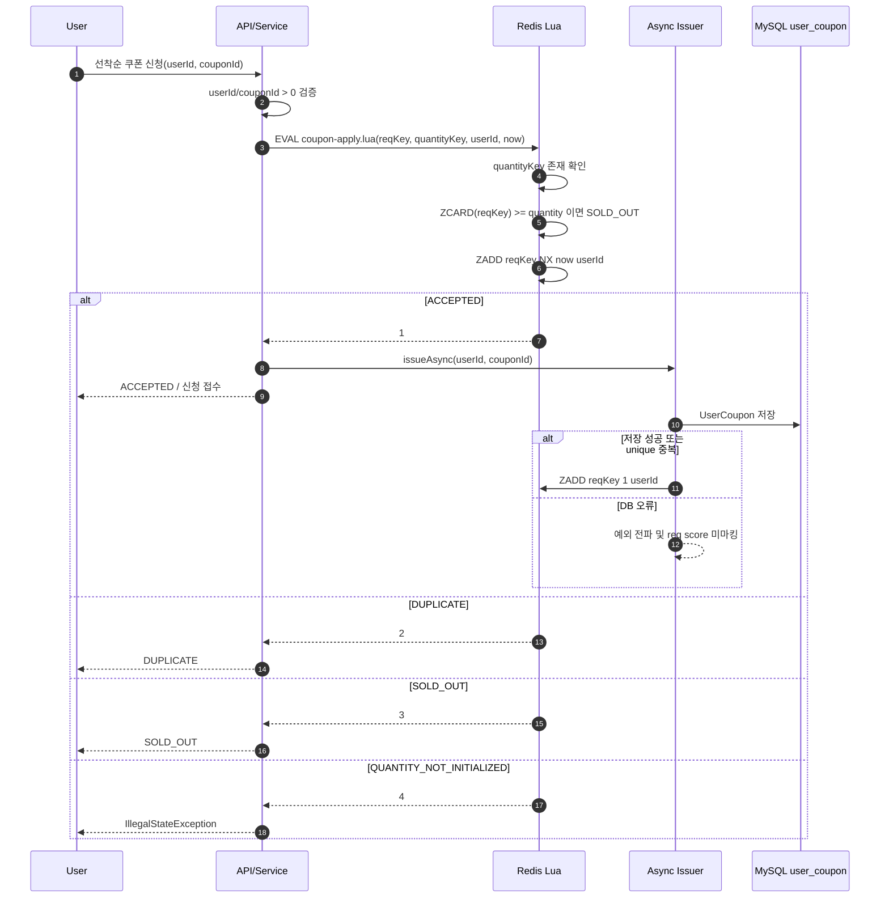
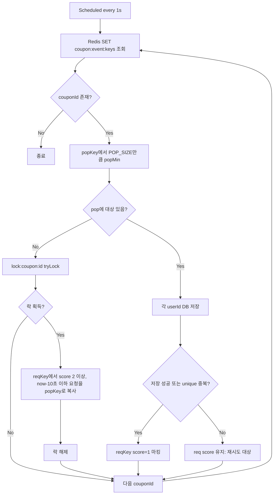
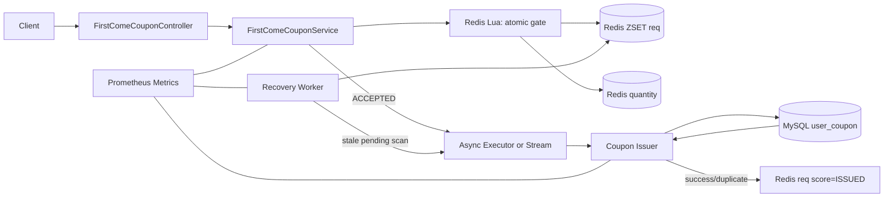

# 선착순 쿠폰 발급 아키텍처 분석

## 1. 현재 구현 요약

현재 선착순 쿠폰 발급은 **Redis를 선착순 접수/수량 제한의 1차 관문**으로 두고, **DB 저장은 비동기 발급 단계**에서 수행하는 구조다.
신청 API는 Redis Lua Script를 실행해 한 번의 원자적 연산으로 `중복 신청`, `재고 소진`, `접수 성공`을 판정한다.
접수 성공 후에는 `CouponIssueAsyncService`가 별도 스레드 풀에서 `user_coupon` 저장을 시도하고, 성공 또는 이미 발급된 중복 케이스는 Redis ZSET score를 `1`로 바꿔 발급 완료 상태를 표시한다.

> 참고: 코드에는 별도 스케줄러 워커(`FirstComeCouponWorker`)도 존재한다. 이 워커는 활성 이벤트 쿠폰 목록을 순회하면서 `req` ZSET의 오래된 미처리 요청을 `pop` ZSET으로 복사하고, `pop`에서 꺼낸 사용자를 DB에 저장하는 보정/배치성 발급 경로로 해석된다.

## 2. 핵심 컴포넌트

| 영역 | 컴포넌트 | 역할 |
| --- | --- | --- |
| API | `CouponController` | 기존 쿠폰 발급 API 엔드포인트. 현재 컨트롤러는 `UserCouponService`를 직접 호출하며, 선착순 서비스와는 별도 경로다. |
| Apply Service | `FirstComeCouponService` | 선착순 신청 유효성 검증, Redis Lua Script 실행, 결과 코드별 응답/메트릭 처리, 비동기 발급 호출. |
| Redis Lua | `coupon-apply.lua` | `quantityKey` 확인, `ZCARD` 기반 수량 제한, `ZADD NX` 기반 중복 방지와 접수 기록을 원자적으로 수행. |
| Async Issuer | `CouponIssueAsyncService` | 접수 성공 사용자를 비동기로 DB 저장하고, 성공/중복 시 `req` ZSET score를 `1`로 마킹. |
| Scheduled Worker | `FirstComeCouponWorker` | 이벤트 쿠폰별로 `req -> pop` 복사 및 `pop` 소비를 수행하는 보정/배치 발급 루프. |
| Redis Key Factory | `CouponRedisKeys` | `coupon:{id}:req`, `coupon:{id}:pop`, `coupon:{id}:quantity`, `coupon:event:keys`, `lock:coupon:{id}` 키 생성. |
| Lock | Redisson `RLock` | 여러 워커 인스턴스가 같은 쿠폰의 `req -> pop` 복사를 동시에 수행하지 않도록 보호. |
| Persistence | `UserCouponRepository` | 최종 발급 이력 저장. DB unique 제약을 최후의 중복 방어선으로 사용. |
| Metrics | `CouponApplyMetrics`, `CouponIssueMetrics` | Redis apply 결과, DB 발급 결과, Redis 마킹 실패 등을 카운팅. |

## 3. Redis 데이터 모델

| Key | Type | Value/Score | 의미 |
| --- | --- | --- | --- |
| `coupon:{couponId}:quantity` | String | 발급 가능 수량 | Lua Script가 이 값이 없으면 `QUANTITY_NOT_INITIALIZED`를 반환한다. |
| `coupon:{couponId}:req` | ZSET | member=`userId`, score=`epochSecond` 또는 `1` | 신청 접수 큐 겸 상태 저장소. 최초 접수 시 현재 초를 score로 저장하고, DB 발급 완료/중복 확정 후 score를 `1`로 변경한다. |
| `coupon:{couponId}:pop` | ZSET | member=`userId`, score=`원 req score` | 워커가 DB 발급 대상으로 꺼내기 위한 중간 버퍼다. |
| `coupon:event:keys` | SET | `couponId` | 워커가 순회할 이벤트 쿠폰 목록이다. |
| `lock:coupon:{couponId}` | Redisson Lock | - | 같은 쿠폰의 `req -> pop` 복사 구간에 대한 분산 락이다. |

## 4. 신청/비동기 발급 흐름

## 5. 워커 보정/배치 발급 흐름

## 6. 현재 아키텍처의 장점

1. **Redis Lua Script로 접수 판정이 원자적이다.** `quantity` 확인, 현재 접수 수 카운트, 중복 방지 삽입이 한 스크립트 안에서 실행되어 동시성 경쟁을 DB보다 앞단에서 차단한다.
2. **DB 부하를 평탄화한다.** 요청 스레드는 Redis 판정 후 빠르게 반환하고, DB 쓰기는 비동기 스레드에서 처리한다.
3. **중복 방어가 2중이다.** Redis `ZADD NX`가 1차 중복 신청을 막고, DB unique 제약이 최종 발급 중복을 방어한다.
4. **결과 관측 지점이 있다.** 신청 결과와 발급 결과 메트릭이 분리되어 Redis 병목/DB 병목을 구분해 볼 수 있다.
5. **보정 워커가 존재한다.** 비동기 발급 실패 또는 미처리 요청을 스캔해 다시 DB 발급 대상으로 만들 수 있는 구조가 있다.

## 7. 리스크와 개선 포인트

### 7.1 수량 차감 기준이 `ZCARD(reqKey)`다

`coupon:{id}:req`는 신청 접수와 완료 상태를 함께 저장한다. Lua Script는 `ZCARD(reqKey)`로 수량을 제한하므로, DB 저장이 실패해도 이미 접수된 사용자는 수량을 점유한다. 선착순 정책이 “접수 기준”이면 적합하지만, “실제 발급 성공 기준”이면 실패분 복구 또는 별도 상태 관리가 필요하다.

### 7.2 비동기 발급과 워커 발급 경로가 중복된다

접수 성공 직후 `CouponIssueAsyncService`가 DB 저장을 수행하고, 동시에 `FirstComeCouponWorker`도 오래된 `req` 항목을 DB 저장 대상으로 삼는다. DB unique 제약으로 최종 중복은 방어되지만, 운영 관점에서는 다음을 명확히 해야 한다.

- 기본 발급 경로가 비동기 서비스인지 워커인지
- 워커가 “재처리 보정용”인지 “주 발급용”인지
- score 값 `1`, `epochSecond`, `2 이상`의 상태 의미가 문서화/상수화되어 있는지

### 7.3 `req -> pop` 복사가 remove가 아닌 add다

워커는 오래된 요청을 `pop`으로 복사한 뒤 `req`에는 그대로 둔다. DB 오류가 나면 `req` score가 유지되어 재시도 가능한 장점이 있지만, `pop`에서 꺼낸 뒤 실패하면 다시 `pop`에 남지 않는다. 다음 스케줄 주기에서 `req`를 다시 스캔해 `pop`으로 복사하는 방식이라 재시도 지연이 발생한다.

### 7.4 활성 쿠폰 키가 두 종류다

`ActiveCouponRegistry`는 `eventCoupon:active`를 쓰고, 워커는 `coupon:event:keys`를 조회한다. 둘 다 활성 쿠폰 목록처럼 보이므로 실제 운영 등록 경로를 하나로 통일하거나 책임을 분리해 명명하는 것이 좋다.

### 7.5 API 연결이 불명확하다

현재 `CouponController`의 `/api/v1/coupon/issue`는 `UserCouponService`를 직접 호출한다. 선착순 신청 API가 별도 컨트롤러에 없다면, `FirstComeCouponService.apply()`가 외부 요청 경로에 연결되어 있는지 확인이 필요하다.

## 8. 권장 목표 아키텍처

권장 방향은 **접수 게이트는 Redis Lua로 유지**하되, 발급 실행 경로를 하나로 단순화하는 것이다. 즉, 신청 성공 이벤트를 `Async Executor`, `Redis Stream`, `Kafka` 중 하나로 전달하고, 워커는 “stale pending 재큐잉” 역할만 수행하게 하면 책임이 명확해진다.

## 9. 개선 체크리스트

- [ ] 선착순 전용 API 엔드포인트가 `FirstComeCouponService.apply()`를 호출하도록 연결한다.
- [ ] `coupon:event:keys`와 `eventCoupon:active` 중 하나로 활성 쿠폰 목록을 통일한다.
- [ ] Redis score magic number를 `PENDING`, `ISSUED` 같은 상수/Enum 문서로 고정한다.
- [ ] 비동기 발급 실패 시 재처리 정책을 명확히 한다. 예: Redis Stream pending entry, DLQ, retry count.
- [ ] “접수 수량 기준”과 “DB 발급 성공 기준” 중 어떤 정책인지 결정하고 수량 카운팅 모델을 맞춘다.
- [ ] 워커의 `req -> pop` 이동을 Lua Script로 원자화하거나, Redis Stream consumer group으로 대체하는 방안을 검토한다.
