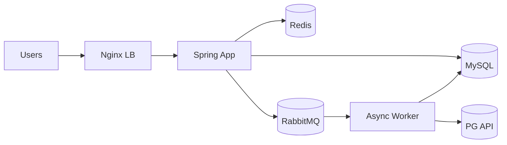

# 🏗 E-Commerce Service Architecture

요청은 Nginx를 거쳐 Spring으로 들어가고, 데이터는 MySQL에 저장됩니다.  
Redis는 캐시/세션/재고보조 용도로, RabbitMQ는 비동기 작업 처리용으로 사용합니다.

---
## 📨 MQ(RabbitMQ) 사용 용도

1.주문 생성 후 바로 처리하지 않아도 되는 작업을 비동기 처리

- 예: 쿠폰 사용 상태 반영, 알림 발송, 포인트 적립

- Spring이 “이벤트”만 MQ에 넣고 바로 응답 → 응답 속도 확보

2.외부 PG 연동처럼 실패/재시도가 필요한 작업을 워커로 위임

- Worker가 MQ 메시지를 읽어서 PG 호출

- 실패하면 다시 큐에 넣거나 DLQ로 분리해 복구
---
## ⚡ Redis 사용 용도

1.자주 조회되는 데이터 캐시

- 예: 상품 목록, 인기 상품, 카테고리 트리

- DB 부하 줄이고 응답 속도 개선

2.세션 / 토큰 / 임시 장바구니 저장

- TTL 기반으로 자동 만료 관리가 쉬움

3.재고 보조 정보

- 실제 재고는 MySQL이 진실, Redis는 “지금 살 수 있냐”를 빠르게 보여주는 용도
